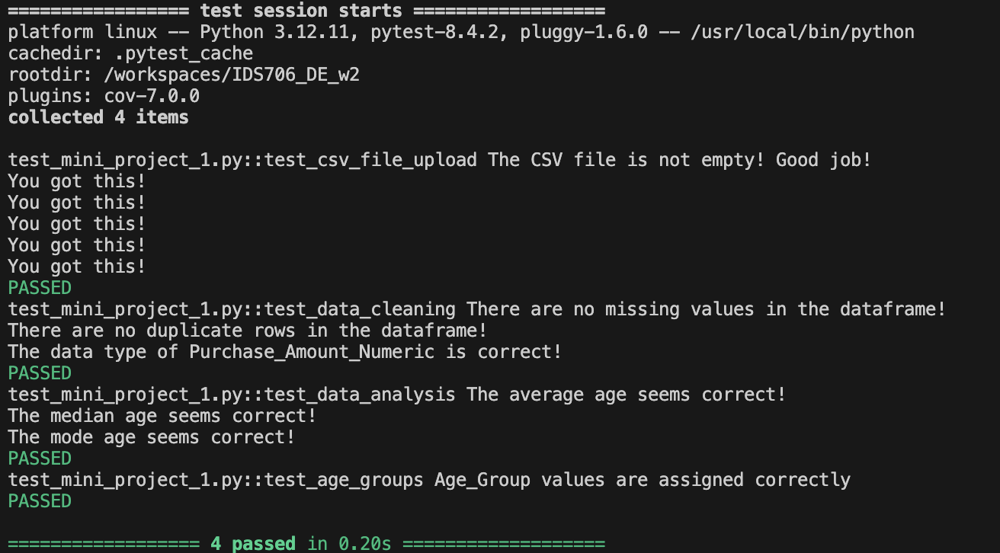
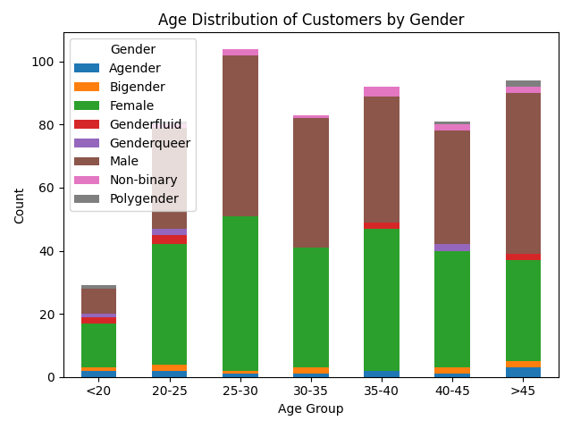
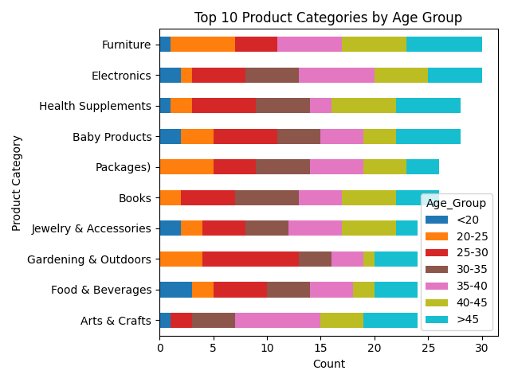
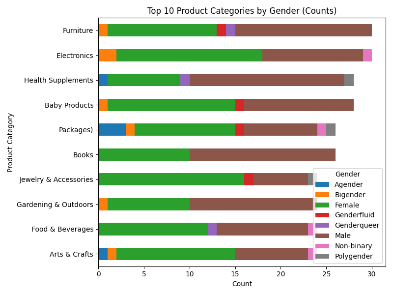

# Install Instruction
**Updated for part 2**

In this file, you can find two ways to set up your environment, pick one that works for you!

First of all, you need to clone it from **GitHub** by running:
```bash
git clone https://github.com/shellyycao/IDS706_DE_w2.git
```

1. You can use the dev container by...
a. Run  
```bash
make install
```
b. Run code in mini_project.py  
c. Run test
```bash
make test
```

2. Or, you can try to use my Dockerfile!
**You must make sure you have Docker on your computer**
a. in the path of your folder (where you store the whole thing), run:  
```bash
docker build -t shellyproject1 .
```
b. Then you can run the whole thing!  
```bash
docker run --rm -it shellyproject1
```
c. You can run the test too:  
```bash
docker run --rm -it shellyproject1 pytest -s -vv
```
d. (Optional) If that is still too complicated, I also published my docker, so you can just...  
```bash
docker pull shellyycao/shellyproject1:latest
docker run --rm -it shellyycao/shellyproject1:latest
```

### Cool! After run the test, you should be able to see...



In this test python file, I checked...

- File Upload: Verified the raw CSV loads, is not empty, and includes required columns (Age, Gender, Purchase_Category, Purchase_Amount, Income_Level).
- Data cleaning: Confirmed the cleaned dataset has no missing values and no duplicate rows, and that Purchase_Amount_Numeric is correctly converted to a numeric type.
- Data analysis sanity checks: Checked that Age statistics (mean, median, mode) fall within a reasonable range (0–100), and age_group is correctly formed. 

————————————————————————————

## What I did to set up all the dev container/docker file?

### for dev container:
1. You need to "Command + P" and search for: >Add Dev Container...
2. Add configuration to workspace
3. Select a template that you like!
4. Enable the requirement.txt line in you .json file (don't know what that is? Well it could be made while you first set up the repo, hint:).  
```bash
touch Makefile
touch name.py
touch test_name.py
touch requirements.txt
```
5. (Assume you figured your makefile already..), Run:
```bash
make install
```
### for docker
1. You need to get a new dockerfile running! How?  
- File -> New File... -> type "Dockerfile" (plz don't alter this!)
2. After you have your dockerfile ready, you need to build it:  
```bash
docker build -t < replace with a fun name > .
```
3. Then run it 
```bash
docker run --rm -it < THE fun name >
```
4. Yeah! You got that!
5. (Optional) If you want to publish your docker so everyone can pull it, you can run:  
```bash
docker login
docker tag <The fun name><your name in docker>/the fun name
docker push <your name in docker>/<fun name>
```
**Note:** Once you have your docker file ready, when select template for your dev container, you can select dockerfile as your template!


————————————————————————————

# IDS706_DE_w2

The data is download from Kaggle, link here: 
https://www.kaggle.com/datasets/salahuddinahmedshuvo/ecommerce-consumer-behavior-analysis-data

**AI usage disclaimer: The python code is created with the help of Copilot and ChatGPT, especially the ML part**

## What is this data?

The E-commerce Consumer Behavior Analysis dataset is a structured collection of demographic and behavioral information about online shoppers. It includes customer details such as age, gender, and income level, along with purchasing factors like product category, purchase amount, frequency, brand loyalty, and satisfaction.

Key Features (from the website):
- Customer Demographics: Understand age, income, gender, and education level for better segmentation and targeted marketing.
- Purchase Behavior: Includes purchase amount, frequency, category, and channel preferences to assess spending patterns.
- Customer Loyalty: Features like brand loyalty, engagement with ads, and loyalty program membership provide insights into long-term customer retention.
- Product Feedback: Customer ratings and satisfaction levels allow for analysis of product quality and customer sentiment.
- Decision-Making: Time spent on product research, time to decision, and purchase intent reflect how customers make purchasing decisions.
- Influences on Purchase: Factors such as social media influence, discount sensitivity, and return rates are included to analyze how external factors affect purchasing behavior.

## What did I do?

1. I imported the e-commerce dataset, cleaned it by dropping missing values and duplicates, and saved a cleaned copy for analysis(just in case).
2. I took a look at the demographics and behavior (age/gender distributions, top product categories, and spending by age group), and visualized trends with bar charts and dot plots.
3. I ran some stat test to test the hypotheses about the effect of age, gender, income, and research time on spending and satisfaction using OLS regression, ANOVA, and t-tests.
4. I built a linear regression model with age, gender, and income level as predictors of purchase amount, and evaluated it with R² and RMSE, finding that these features alone don’t explain spending well.

##### Note: I also use ChatGPT to help me convert the code so it can go through "make lint"

## What are some findings(so far)?

1. Customers are spread fairly across age groups, with the largest concentration in the 25–30 range; male and female customers make up the majority, while other gender identities are represented in much smaller proportions.


2. Electronics and Furniture are the most popular categories,customers across all age groups show interest in similar categories. Male customers purchase the most in Health Supplements, while female customers purchase the most in Jewelry & Accessories



3. Income Level was surprisingly not a significant predictor of spending!

4. A linear regression model using Age, Gender, and Income Level to predict purchase amount performed poorly. More informative featuresmay be needed for better predictive performance. **Future investigation need to be done**


-------------------------


## Set up the file

First, you might want to clone the repository in your local enviroment by calling "git clone " in the command line.

In the local environment(VS code), set up the following in the terminal:
- Type in
<pre markdown="1"> ```
make install
``` </pre>
- Run mini_project_1.py
- - You could run it in the interactive window for better results.
